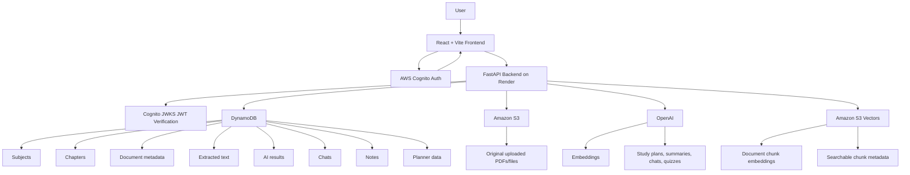

# StudyFlow - AI-Powered Study Planner and Document RAG Platform

StudyFlow is a full-stack study productivity platform that helps students organize subjects, upload study material, generate AI study plans, chat with documents, create quizzes, and track progress. The upgraded version uses persistent cloud storage and a production-style RAG pipeline powered by OpenAI embeddings and Amazon S3 Vectors.

**Live Demo:** [https://ddr1k3uxkbzvy.cloudfront.net](https://ddr1k3uxkbzvy.cloudfront.net)

---

## Overview

StudyFlow combines four major workflows:

- **Study planning:** create study schedules, log progress, handle missed days, and track completion.
- **Document library:** organize uploaded files by subject and chapter.
- **AI document intelligence:** generate study plans, summaries, notes, quizzes, and document Q&A.
- **Persistent RAG:** store semantic document embeddings in S3 Vectors for scalable retrieval across sessions and devices.

The app is designed so a student can upload course material once, keep it stored in the cloud, and continue using summaries, chats, notes, and study plans from any device.

---

## Key Features

### Authentication and Cloud Persistence

- AWS Cognito sign-up, login, and forgot-password flow.
- Backend JWT signature verification using Cognito JWKS.
- User-scoped cloud storage for planner data, subjects, chapters, documents, notes, chats, summaries, and progress.
- Data persists across reloads and devices.

### Subject and Chapter Library

- Create subjects and nested chapters.
- Upload documents at subject level or chapter level.
- Move documents between subjects and chapters.
- Accurate sidebar counts after reload, upload, move, and delete.
- Subject/chapter deletion cascades through related documents, notes, chats, files, and vectors.

### Document Uploads and Viewer

- Upload PDFs and other supported study files.
- Store original files in Amazon S3.
- Save document metadata and extracted text in DynamoDB.
- Generate fresh presigned S3 URLs so documents continue working after reload.
- In-app PDF viewer with page navigation and highlight-ready document experience.

### AI Study Tools

- Generate structured study plans from uploaded documents.
- Generate exam-ready summaries.
- Generate study notes from documents.
- Generate quiz questions and answers.
- Chat with a specific document.
- Chat across the full document library with source attribution.
- Increased analysis token budget for longer study plans and summaries.

### Persistent RAG With S3 Vectors

- Splits document text into chunks.
- Generates embeddings with OpenAI `text-embedding-3-large` (1536 dims).
- Stores embeddings and chunk metadata in Amazon S3 Vectors.
- Uses vector search for document chat and global library chat.
- Includes batch backfill for documents uploaded before vector indexing existed.
- Includes vector indexing status and retry controls.

### Study Planner

- Adaptive scheduling based on difficulty, syllabus size, urgency, and available hours.
- Progress tracking for studied hours and missed days.
- Prevents logging future days.
- Completion percentage calculation.
- Smart rescheduling for plan adjustments.
- Dashboard charts for progress and study distribution.

---

## Tech Stack

### Frontend

- React 18
- Vite
- React Router
- Tailwind CSS
- Recharts
- Lucide React
- Framer Motion
- pdfjs-dist
- mammoth
- tesseract.js
- jsPDF

### Backend

- FastAPI
- Python
- OpenAI API
- NumPy
- boto3
- PyJWT with Cognito JWKS verification

### AWS and Hosting

- AWS Cognito for authentication
- Amazon DynamoDB for application data
- Amazon S3 for original uploaded files
- Amazon S3 Vectors for embedding storage and semantic retrieval
- Amazon CloudFront for frontend CDN hosting
- Render for backend hosting

---

## Architecture



---

## Core RAG Pipeline


### Vector Metadata

Each stored vector includes metadata such as:

- `userId`
- `docId`
- `subjectId`
- `chapterId`
- `locationType`
- `fileName`
- `chunkIndex`
- `embeddingVersion`
- `text`

This allows user-scoped and document-scoped semantic retrieval.

---

## Application Data Model

```text
DynamoDB
  USER#{userId} / PLANNER
  USER#{userId} / SUBJECT#{subjectId}
  USER#{userId} / CHAPTER#{subjectId}#{chapterId}
  USER#{userId} / SDOC#{subjectId}#{docId}
  USER#{userId} / CDOC#{chapterId}#{docId}
  USER#{userId} / SNOTE#{subjectId}
  USER#{userId} / CNOTE#{chapterId}
  USER#{userId} / CHAT#DOC#{docId}
  USER#{userId} / CHAT#GLOBAL

Amazon S3
  Original uploaded files

Amazon S3 Vectors
  Chunk embeddings and chunk metadata
```

---

## Problems Solved During Upgrade

### PDF reload persistence

**Problem:** Uploaded PDFs opened correctly immediately after upload, but after a site reload the document viewer showed "No PDF available."

**Cause:** The app depended on temporary frontend/session URLs instead of a persistent cloud file reference.

**Solution:** Store the permanent S3 object key in DynamoDB and generate fresh presigned S3 URLs whenever documents are listed or opened.

### Lazy chapter counts

**Problem:** The subject panel showed `0` chapters after reload until the subject was clicked.

**Cause:** Counts were derived lazily from frontend state instead of loaded from the backend.

**Solution:** Calculate chapter counts in backend list endpoints and keep sidebar counts updated after document moves, uploads, and deletes.

### Incomplete cloud cleanup

**Problem:** Deleting documents, subjects, or plans could leave related data behind.

**Solution:** Add cleanup across DynamoDB records, S3 files, chat history, and S3 Vector chunks.

### Weak JWT handling

**Problem:** JWT payloads were not being fully verified.

**Solution:** Verify Cognito JWT signatures using JWKS, issuer checks, and client ID validation.

### Inefficient RAG

**Problem:** Earlier RAG behavior recalculated document embeddings per request.

**Solution:** Store embeddings persistently in S3 Vectors and query them during document/global chat.

### Vector migration safety

**Problem:** Existing documents needed a safe way to enter the new vector index.

**Solution:** Add batch vector backfill from Settings and keep `VECTOR_RAG_ENABLED=false` until documents are indexed.

---

## Project Structure

```text
.
├── main.py                         # FastAPI backend and API routes
├── vector_store.py                 # S3 Vectors indexing/query/delete helpers
├── requirements.txt                # Python backend dependencies
├── package.json                    # Frontend dependencies and scripts
├── src/
│   ├── App.jsx                     # App routing and top-level state
│   ├── main.jsx                    # React entry point
│   ├── index.css                   # Global styles
│   ├── contexts/
│   │   ├── AuthContext.jsx         # Cognito auth state
│   │   └── ThemeContext.jsx        # Theme state
│   ├── pages/
│   │   ├── DashboardPage.jsx       # Study dashboard
│   │   ├── LibraryPage.jsx         # Subject/chapter/document workspace
│   │   ├── SettingsPage.jsx        # Settings, export, vector backfill
│   │   ├── LoginPage.jsx
│   │   ├── SignupPage.jsx
│   │   └── ForgotPasswordPage.jsx
│   ├── components/
│   │   ├── DocumentViewer.jsx      # In-app PDF viewer
│   │   ├── ProgressTracker.jsx
│   │   └── library/
│   │       ├── SubjectPanel.jsx
│   │       ├── SubjectContent.jsx
│   │       ├── ChapterContent.jsx
│   │       ├── DocCard.jsx
│   │       ├── AnalysisPanel.jsx
│   │       ├── GlobalChatbot.jsx
│   │       ├── UploadModal.jsx
│   │       ├── MoveModal.jsx
│   │       └── NotesEditor.jsx
│   └── utils/
│       ├── api.js                  # Backend API client
│       ├── auth.js                 # Cognito helpers
│       └── PlannerEngine.js        # Study plan scheduling logic
```

---

## Local Development

### Prerequisites

- Node.js 18+
- npm
- Python 3.11+
- AWS account
- OpenAI API key

### Frontend

```bash
npm install
npm run dev
```

Vite will print the local URL, usually:

```text
http://localhost:5173
```

### Backend

Install Python dependencies:

```bash
pip install -r requirements.txt
```

Run FastAPI locally:

```bash
uvicorn main:app --reload
```

The frontend API client currently points to the deployed Render backend. For local backend development, update the API base URL in `src/utils/api.js` or introduce a `VITE_API_BASE_URL` environment variable.

---

## Environment Variables

Backend environment variables:

```env
OPENAI_API_KEY=
AWS_ACCESS_KEY_ID=
AWS_SECRET_ACCESS_KEY=
AWS_REGION=ap-south-1
COGNITO_APP_CLIENT_ID=
ALLOWED_ORIGINS=

S3_VECTOR_REGION=ap-south-1
S3_VECTOR_BUCKET=studyflow-vectors-prod
S3_VECTOR_INDEX=studyflow-document-chunks-v1
EMBEDDING_MODEL=text-embedding-3-large
EMBEDDING_DIMENSIONS=1536
EMBEDDING_VERSION=2
VECTOR_RAG_ENABLED=true
VECTOR_INDEXING_ENABLED=true
```

`VECTOR_RAG_ENABLED` should stay `false` until existing documents have been backfilled into S3 Vectors.

---

## Deployment

### Frontend: S3 + CloudFront

Build the frontend:

```bash
npm run build
```

Upload the contents of `dist/` to the S3 bucket used by CloudFront:

```text
dist/index.html
dist/vite.svg
dist/assets/
```

Upload the `assets` folder as a folder, not as loose files at the bucket root. Do not upload the parent `dist` folder itself.

After upload, create a CloudFront invalidation:

```text
/*
```

### Backend: Render

Deploy the FastAPI backend from the latest `main` branch.

Render should install:

```bash
pip install -r requirements.txt
```

Typical start command:

```bash
uvicorn main:app --host 0.0.0.0 --port $PORT
```

### Vector RAG rollout

1. Deploy backend with `VECTOR_RAG_ENABLED=false`.
2. Deploy frontend.
3. Log in to StudyFlow.
4. Go to Settings -> Data & storage -> Index document library.
5. Click `Index batch` until documents show `Vector indexed`.
6. Change `VECTOR_RAG_ENABLED=true` on Render.
7. Redeploy backend.
8. Test document chat and global chat.

---

## Security Notes

- Uploaded files are stored privately in S3 and accessed with presigned URLs.
- Document text and AI results are stored in DynamoDB.
- Chunk text is stored as S3 Vector metadata for retrieval, so vector storage must be treated as sensitive.
- Backend verifies Cognito JWT signatures before accessing user data.
- AI endpoints should be protected with rate limits before heavy production use.
- CORS should include only trusted frontend origins in production.
- Account deletion should be audited to ensure full cleanup across DynamoDB, S3, and S3 Vectors.

---

## Validation

The upgraded project was validated with:

```bash
python -m py_compile main.py vector_store.py
npm run build
git diff --check
```

---

## License

MIT

---

Built by [Saharsh Saraf](https://github.com/saharshsaraf03)
